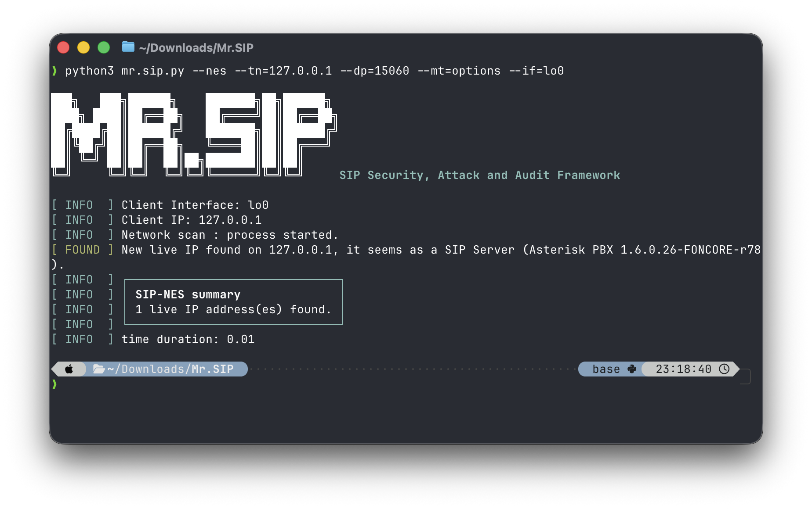

<div align="center">


**SIP Security, Attack and Audit Framework**

[](LICENSE)
[](https://github.com/n0connect/Mr.SIP/actions/workflows/ci.yml)

[](https://www.blackhat.com/eu-19/arsenal/schedule/#mrsip-sip-based-audit--attack-tool-18190)
[](https://www.blackhat.com/us-19/arsenal/schedule/index.html#mrsip-sip-based-audit--attack-tool-16866)
[](https://www.blackhat.com/asia-19/arsenal/schedule/index.html#mrsip-sip-based-audit-and-attack-tool-14381)
[](https://www.blackhat.com/eu-20/arsenal/schedule/index.html#mrsip-sip-based-audit-and-attack-tool-21775)
[](https://2019.offzone.moscow/report/mr-sip-sip-based-audit-and-attack-tool/)
[](https://www.defcon.org/html/defcon-safemode/dc-safemode-speakers.html#Tas)
[](https://www.blackhat.com/asia-23/arsenal/schedule/index.html#mrsip-the-ultimate-sip-based-penetration-testing-tool-for-voip-systems-31308)
[](https://2023.securi-tay.co.uk/)
[](https://web.archive.org/web/20221103121858/https://blackhatmea.com/speaker/ismail-melih-tas)
[](https://www.blackhat.com/eu-22/arsenal/schedule/index.html#mrsip-sip-based-audit-and-attack-tool-29629)

</div>

---

Mr.SIP is a simple, console-based SIP audit and attack tool. It was originally developed for academic work on novel SIP-based DDoS attacks, and evolved into a fully functional SIP-based penetration testing tool. It has since been cited in several academic papers and journal articles, and can also be used as a SIP client simulator and traffic generator.

This public repository ships **3 modules** — network scanning, user enumeration, and DoS attack simulation. **[Mr.SIP Pro](#mrsip-pro)** extends this with more modules and a web GUI.

## Documentation

- **[Installation](docs/installation.md)** — Linux/macOS setup differences, virtual environment setup, when root is actually required
- **[Lab Guide](docs/lab-guide.md)** — Building a local test target: Docker (PJSIP) and VM (classic `chan_sip`/Trixbox) labs, generalizing to other Asterisk-based PBXs
- **[Usage Guide](docs/usage-guide.md)** — Full command reference, what each `--mt` message type actually does, `--if`/`--pps`/`--mtu` in depth, `ngrep`, debug mode, architecture/data-flow diagram
- **[Mr.SIP Pro comparison](docs/mrsip-pro.md)** — Full public-vs-Pro breakdown, module-by-module
- **[CHANGELOG.md](CHANGELOG.md)** — Full version history and technical rationale for each change

## Public Version Modules

| Module | Purpose |
|---|---|
| **SIP-NES** (Network Scanner) | Detects SIP components on a network, along with manufacturer/product/version information. |
| **SIP-ENUM** (Enumerator) | Identifies valid SIP users and their authentication requirements. |
| **SIP-DAS** (DoS Attack Simulator) | Performs TDoS-based attacks, with a powerful IP-spoofing engine. |

Competitive features across all three: high-performance multithreading, IP spoofing, and smart SIP message generation.

This is the public, 3-module version — see what **[Mr.SIP Pro](#mrsip-pro)** adds below.

## Mr.SIP Pro

Mr.SIP Pro is the most comprehensive attack-oriented VoIP product available — 10 modules across 3 categories (Information Gathering, Vulnerability Scanning, Offensive), plus IP spoofing/message-generation helper components and a GUI, versus this repo's 3 console-only modules.

→ **[Full Public vs. Pro comparison](docs/mrsip-pro.md)** · **[mrsip.pro](https://www.mrsip.pro/)** · **[Pricing](https://www.mrsip.pro/#pricing)** · **[Request a demo](https://www.mrsip.pro/demo)**

## Quick Start

```bash
pip install -r requirements.txt

python3 mr.sip.py --help
```

```bash
python3 mr.sip.py --nes  --tn=<target_IP> --mt=options --from=<ext> --to=<ext>
python3 mr.sip.py --enum --from=<wordlist_file> [--tn=<target_IP>]
python3 mr.sip.py --das  --mt=invite -c <count> --tn=<target_IP> [-r|-s|-m --il=<file>]
```

See the [Installation Guide](docs/installation.md) for OS-specific setup and the [Usage Guide](docs/usage-guide.md) for the full command/flag reference.

<div align="center">

</div>

## Development

This repo has a real test suite and CI - see [CHANGELOG.md](CHANGELOG.md) for the full technical history of fixes and hardening work.

```bash
pip install -r tests/requirements-dev.txt
pytest              # 262 tests, network-free, runs in a couple seconds
ruff check src/ tests/ mr.sip.py
```

---

## Recognition

Mr.SIP started as academic research into novel SIP-based DDoS attacks and grew into a tool presented at some of the industry's largest security conferences, cited across peer-reviewed literature, and recognized in national innovation competitions.

### Global Stage Recognition

- [Black Hat Asia 2023 (Arsenal), Singapore – Mr.SIP: Audit and Attack Tool](https://www.blackhat.com/asia-23/arsenal/schedule/index.html#mrsip-the-ultimate-sip-based-penetration-testing-tool-for-voip-systems-31308)
- [Securi-Tay 2023 (Opening Keynote), Scotland – Practical VoIP/UC Hacking Using Mr.SIP](https://2023.securi-tay.co.uk/)
- [Black Hat MEA 2022 (Briefing & Arsenal), Riyadh – VoIP Hacking Demos & Network Attacks](https://web.archive.org/web/20221103121858/https://blackhatmea.com/speaker/ismail-melih-tas)
- [Black Hat EU 2022 (Arsenal), London – VoIP Hacking Demo Using Mr.SIP Pro](https://www.blackhat.com/eu-22/arsenal/schedule/index.html#mrsip-sip-based-audit-and-attack-tool-29629)
- [Black Hat EU 2020 (Arsenal), London – Mr.SIP: SIP-Based Audit & Attack Tool](https://www.blackhat.com/eu-20/arsenal/schedule/index.html#mrsip-sip-based-audit-and-attack-tool-21775)
- [DEF CON 28 (Main Stage), Las Vegas – Practical VoIP Penetration Testing Using Mr.SIP Pro](https://defcon.org/html/defcon-safemode/dc-safemode-speakers.html#Tas)
- [Black Hat USA 2019 (Arsenal), Las Vegas – Mr.SIP: SIP-Based Audit & Attack Tool](https://www.blackhat.com/us-19/arsenal/schedule/?hootPostID=07db0310b95d74a656ef575b3eaaf2d5#mrsip-sip-based-audit--attack-tool-16866)
- [Black Hat EU 2019 (Arsenal), London – Mr.SIP: SIP-Based Audit & Attack Tool](https://www.blackhat.com/eu-19/arsenal/schedule/#mrsip-sip-based-audit--attack-tool-18190)
- [OffZone 2019, Moscow – SIP-Based Attacks & Defense Approaches](https://2019.offzone.moscow/report/mr-sip-sip-based-audit-and-attack-tool/)
- [Black Hat Asia 2019 (Arsenal), Singapore – Mr.SIP: SIP-Based Audit & Attack Tool](https://www.blackhat.com/asia-19/arsenal/schedule/index.html#mrsip-sip-based-audit-and-attack-tool-14381)

See presentation links and video demos on the [Demo Page](https://www.mrsip.pro/demo).

### Academic & Technical Impact

Mr.SIP's methodologies have been cited in leading SCI-indexed journals and international conference proceedings (4 papers listed below, each individually verified against its publisher). The Cisco Press reference and graduate-thesis citations below are the author's own reported claims — searched independently while writing this section, but no specific book title, thesis, institution, or date could be found publicly to cite alongside them, including on Mr.SIP Pro's own site; noted here rather than silently dropped, since the absence of a public citation isn't evidence the claim is false, just that it can't be independently confirmed from outside sources.

- [Blockchain-Based Caller-ID Authentication (BBCA): A Novel Solution to Prevent Spoofing Attacks in VoIP/SIP Networks — IEEE Access (2024)](https://ieeexplore.ieee.org/abstract/document/10508353)
- [A Novel Approach for Efficient Mitigation Against the SIP Based DRDoS Attack — MDPI Applied Sciences (2023)](https://www.mdpi.com/2076-3417/13/3/1864)
- [A Novel SIP Based Distributed Reflection Denial-of-Service Attack and an Effective Defense Mechanism — IEEE Access (2020)](https://ieeexplore.ieee.org/abstract/document/9114982)
- [Novel SIP-Based DDoS Attacks with Effective Defense Strategies — Elsevier Computers & Security (2016)](https://www.sciencedirect.com/science/article/abs/pii/S0167404816300980)

Mr.SIP's academic contributions include the following attack/defense concepts across the papers above:

- SIP-based DRDoS attacks and mitigation strategies
- Blockchain-based caller-ID authentication (BBCA)
- SIP response/request reflection attacks
- SIP registration erasure attacks on call centers
- INVITE/REGISTER abuse techniques

Also used in Caller-ID spoofing tests as part of a Turkish Standards Institute (TSE) collaboration on national VoIP security strategy (2015), and shared on various popular forums and news sources including [Black Hat's own homepage](https://www.blackhat.com/latestintel/01222019-discover-new-tools.html) (verified: a real Black Hat Asia Arsenal feature article describing Mr.SIP directly).

Featured by [Black Hat Arsenal Highlights](https://www.blackhat.com/latestintel/01222019-discover-new-tools.html) and showcased at numerous global conferences — including [Black Hat Arsenal](https://www.blackhat.com/eu-22/arsenal/schedule/index.html#mrsip-sip-based-audit-and-attack-tool-29629) and [DEF CON](https://defcon.org/html/defcon-safemode/dc-safemode-speakers.html#Tas) main stage.

### Awards & Recognition

Mr.SIP Pro has earned recognition through innovation-driven challenges and national competitions — including awards for ideas, early prototypes, or research projects that contributed directly to its foundation and evolution.

- 🥇 1st Place (Gold) – [2nd Cybersecurity Capstone Projects Competition](https://tr.linkedin.com/posts/siberkume_siberg%C3%BCvenlikhaftas%C4%B1-activity-6747918504298594304-wK2K) (55 applications, 17 finalists, 2020) — corrected from a previous "130+ projects" claim that didn't match the primary source; verified directly against the organizer's own results post, which names Ismail Melih Tas as the gold-medal winner
- 🥈 2nd Place – Netaş Innovation Challenge (2012)
- 🥇 1st Place – Netaş Innovation Challenge (2011)

  (These two Netaş placements were searched for independently but couldn't be matched to a public primary source, unlike the 2020 competition above — an old, likely-internal corporate competition from 2011-2012 not being indexed publicly isn't unusual, so this is noted rather than treated as confirmed or removed.)

### Published References (full citations)

- I. M. Tas, B. G. Unsalver, and S. Baktir, "A Novel SIP Based Distributed Reflection Denial-of-Service Attack and an Effective Defense Mechanism," *IEEE Access*, vol. 8, pp. 112574–112584, Jun. 2020. [Read more](https://ieeexplore.ieee.org/abstract/document/9114982)
- I. M. Tas, B. Ugurdogan, and S. Baktir, "Novel Session Initiation Protocol Based Distributed Denial-of-Service Attacks and Effective Defense Strategies," *Computers & Security*, vol. 63, pp. 29–44, Nov. 2016. [Read more](https://www.sciencedirect.com/science/article/pii/S0167404816300980)

## License

[GPL-3.0](LICENSE)
