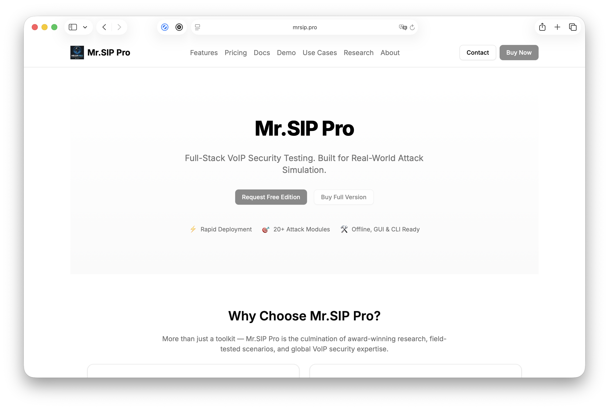

← [Back to README](../README.md)

# Mr.SIP Pro

This repository is the **public, open-source** edition of Mr.SIP — 3 modules, console-only, free to use and modify under its GPLv3 license. **[Mr.SIP Pro](https://www.mrsip.pro/)** is the commercial edition built on the same core: a full-stack VoIP security testing platform for teams that need the complete attack surface, structured reporting, and a GUI — not just the open-source starting point.

## Why teams upgrade

The public repo you're reading is deliberately scoped: three modules, no installer, no GUI. Mr.SIP Pro exists for the parts of a real VoIP engagement that scope doesn't cover — traffic interception, credential cracking, signaling manipulation, and multi-step scenario automation — built on the same research lineage that put Mr.SIP on stage at Black Hat Arsenal, DEF CON, and Offzone Moscow (see [README.md's Global Stage Recognition](../README.md#global-stage-recognition) for the verified presentation history).

## Public vs. Pro at a glance

| | Public (this repo) | Mr.SIP Pro |
|---|---|---|
| Modules | 3 | 10, across 3 categories |
| Categories | Information Gathering, Offensive | Information Gathering, Vulnerability Scanning, Offensive |
| Helper components | — | IP Spoofing Engine, Message Generator |
| Interface | Console only | Console + GUI |
| Traffic sniffing / MiTM | — | SIP-SNIFF, SIP-EAVES, SIP-MANMID |
| Vulnerability/exploit scanning | — | SIP-VSCAN |
| Credential attacks | — | SIP-CRACK (real-time digest cracking) |
| Caller-ID manipulation | — | SIP-SIM |
| Scenario automation | — | SIP-ASP (stateful attack scenario player) |
| License / pricing | Open source (GPLv3), this repo | Commercial — see [Pricing](https://www.mrsip.pro/#pricing) |

## Module breakdown

| Category | Modules |
|---|---|
| **Information Gathering** | SIP-NES (network scanner) · SIP-ENUM (enumerator) · SIP-SNIFF (traffic sniffer, MiTM-capable) · SIP-EAVES (call eavesdropper, MiTM-capable) |
| **Vulnerability Scanning** | SIP-VSCAN (vulnerability & exploit scanner) |
| **Offensive** | SIP-DAS (DoS attack simulator) · SIP-MANMID (MiTM attacker) · SIP-ASP (attack scenario player) · SIP-CRACK (real-time digest authentication cracker) · SIP-SIM (signaling manipulator, Caller-ID spoofing) |

Mr.SIP Pro detects SIP components and existing users on a network, intercepts and manipulates call information, reports known vulnerabilities and exploits, runs various TDoS attacks (including status-controlled advanced ones), and cracks user passwords. It also supports a customizable scenario-development framework for stateful, multi-step attacks.

**Roadmap:** 5 additional modules and a friendlier GUI are planned — fuzzing, media sniffing, media injection/manipulation, robocall (SPIT), and DTMF tone stealing.

**Note on the numbers above**: the table's "10 modules, 3 categories" is this doc's own, more granular technical breakdown (named modules, listed below). The live `mrsip.pro` site itself currently uses different framing in its own marketing copy - a "20+ Attack Modules" figure in its hero section, and a 5-tab feature grouping (Discovery / Vulnerability / Attack / Media / Automation) rather than 3 categories. Checked directly against the live site rather than assumed, but not fully reconcilable from the outside: the site's tabbed UI doesn't expose a complete feature-by-feature list without clicking through each tab, so it's unclear whether "20+" is a stricter module count the product has grown into since this table was last verified, or a broader count of sub-features/techniques within the same modules. Left the detailed table below as-is (it's more specific and technically useful than the marketing figure either way), but flagging this rather than presenting either number as settled.

## Explore further

| | |
|---|---|
| **[Features](https://www.mrsip.pro/#features)** | Full feature breakdown by category |
| **[Pricing](https://www.mrsip.pro/#pricing)** | Individual, team/consultant, and custom-engagement plans |
| **[Docs](https://www.mrsip.pro/docs)** | Installation, licensing, and usage reference |
| **[Demo](https://www.mrsip.pro/demo)** | Recorded walkthroughs and live-demo sessions |
| **[Use Cases](https://www.mrsip.pro/use-cases)** | Red team, consultant, and enterprise scenarios |
| **[Research](https://www.mrsip.pro/research)** | The academic/industry work behind Mr.SIP Pro |
| **[About](https://www.mrsip.pro/about)** / **[Contact](https://www.mrsip.pro/contact)** | The team, and how to reach them |

→ **[mrsip.pro](https://www.mrsip.pro/)**
