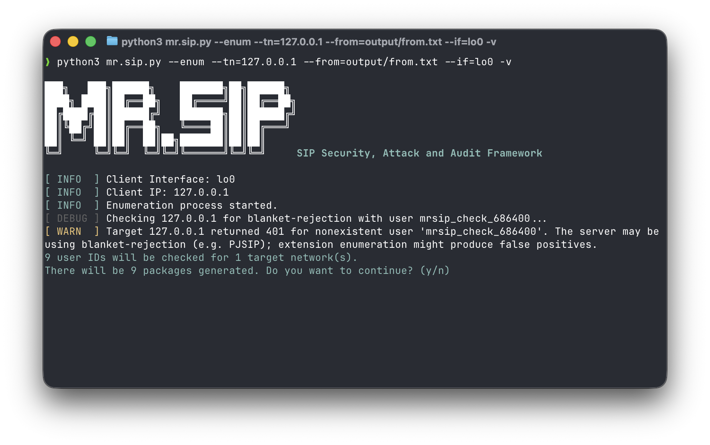
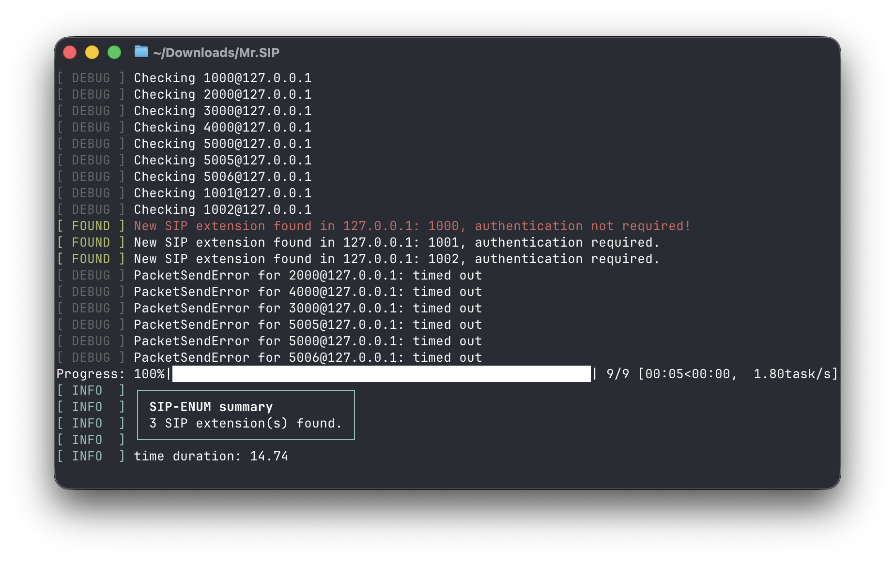
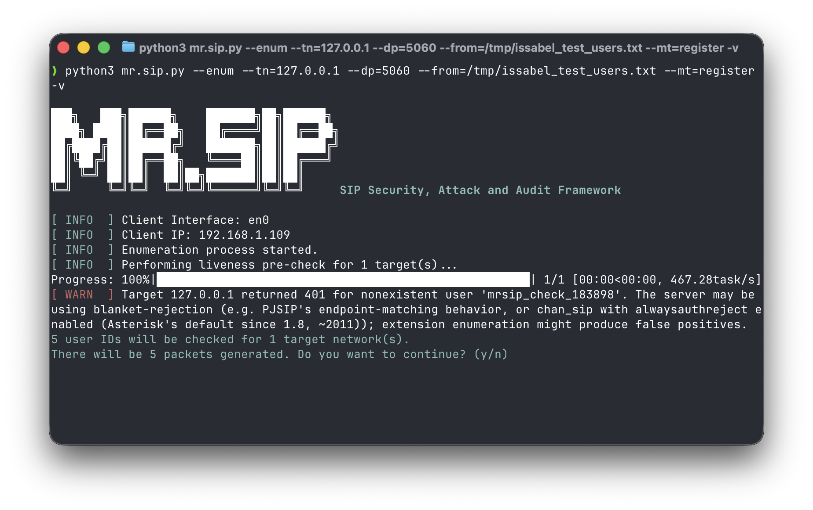
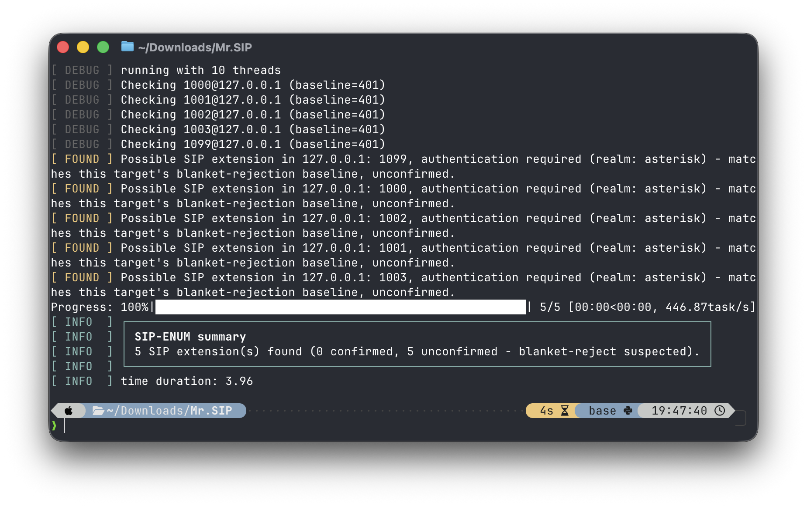
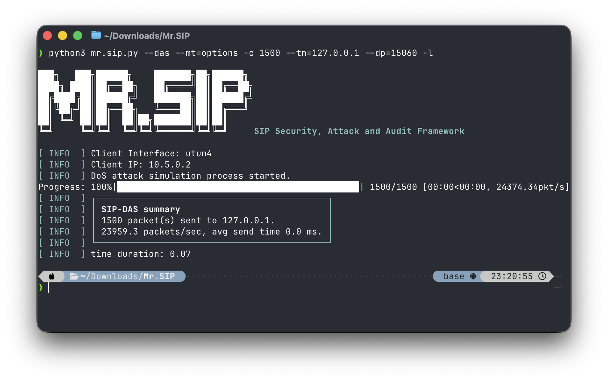
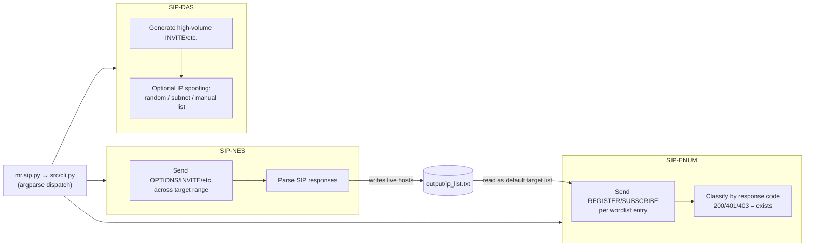

← [Back to README](../README.md)

# Usage Guide

- [Quick reference](#quick-reference)
- [Global parameters](#global-parameters)
- [Understanding `--mt`: what each message type actually does](#understanding---mt-what-each-message-type-actually-does)
- [SIP-NES — Network Scanner](#sip-nes--network-scanner)
- [SIP-ENUM — Enumerator](#sip-enum--enumerator)
- [SIP-DAS — DoS Attack Simulator](#sip-das--dos-attack-simulator)
- [Choosing the right network interface (`--if`)](#choosing-the-right-network-interface---if)
- [Watching live SIP traffic with `ngrep`](#watching-live-sip-traffic-with-ngrep)
- [Debug mode and logging](#debug-mode-and-logging)
- [Architecture / module data flow](#architecture--module-data-flow)
- [Module behavior under different conditions](#module-behavior-under-different-conditions)

## Quick reference

```bash
python3 mr.sip.py [--nes|--enum|--das] [parameters]
```

The three modules are mutually exclusive — pick one per invocation. See [lab-guide.md](lab-guide.md) for a target to practice against.

If you set up a virtual environment during [installation](installation.md), make sure it's active in this terminal (`source .venv/bin/activate`) before running any command below — a new terminal session starts without it, and the commands will otherwise silently fall back to your system Python.

## Global parameters

| Parameter | Default | Notes |
|---|---|---|
| `--tn` / `--target-network` | — | Single IP, range (`192.168.1.10-192.168.1.20`), or CIDR (`192.168.1.0/24`) for SIP-NES/SIP-ENUM. SIP-DAS floods one fixed target and rejects a range/CIDR here with a clean error. |
| `--dp` / `--destination-port` | `5060` | Target SIP port (1–65535) |
| `--mt` / `--message-type` | module-specific | `options`, `invite`, `register`, `subscribe`, `cancel`, `bye`, or any custom `.message` template in `src/data/method/` |
| `--from` / `--from-user` | bundled `fromUser.txt` | Extension number or wordlist file |
| `--to` / `--to-user` | bundled `toUser.txt` | Extension number or wordlist file |
| `--su` / `--sp-user` | bundled `spUser.txt` | Service-provider user wordlist (used by the `sp-invite` template) |
| `--ua` / `--user-agent` | bundled `userAgent.txt` | Spoofed `User-Agent` header wordlist. Only `invite`/`register` fill this in from the wordlist - `subscribe` hardcodes its own `User-Agent: Nortel PCC 6.0.155`, and `options`/`cancel`/`bye`/`sp-invite` don't send a `User-Agent` header at all, so `--ua` has no effect with those. |
| `--il` / `--manual-ip-list` | — | IP list file (SIP-DAS `-m` mode, or a pre-built target list) |
| `--if` / `--interface` | Scapy auto-detected (`conf.iface`) | See [below](#choosing-the-right-network-interface---if) |
| `--tc` / `--thread-count` | `10` | Worker threads (SIP-NES/SIP-ENUM); minimum `1` |
| `--rt` / `--response-timeout` | `5` seconds | SIP-NES/SIP-ENUM — how long to wait for a response before giving up on a single probe. Lower it (e.g. `--rt 1`) when scanning a large range where most hosts won't respond at all: each non-responsive probe otherwise blocks its worker thread for the full timeout, so overall throughput is bounded by `thread_count / timeout` — raising `--tc` helps, but a long `--rt` still limits how much each dead host costs a thread |
| `--skip-live-check` | off | SIP-ENUM/SIP-DAS — skip the short (2s) liveness probe normally sent before enumerating/flooding a target. SIP-ENUM then enumerates every given target as-is instead of pre-filtering out non-responsive ones; SIP-DAS just silences the "target didn't respond to an initial probe" warning (it never blocks on this probe either way — see [Module behavior under different conditions](#module-behavior-under-different-conditions)) |
| `--mtu` | unset | Fragments packets to this MTU, Scapy mode only (min. 68 bytes) |
| `--pps` / `--packets-per-second` | unthrottled | SIP-DAS only — caps send rate |
| `-v` / `--verbose` | off | DEBUG-level console logging — see [Debug mode](#debug-mode-and-logging) |
| `-i` / `--ip-save-list` | `output/ip_list.txt` | SIP-NES writes live hosts here; SIP-ENUM reads it by default |
| `-y` / `--yes` | off | Auto-answer "yes" to the "N packets will be generated, continue?" confirmation (SIP-NES/SIP-ENUM bulk runs) — for scripted/non-interactive use. Without it, a non-interactive shell (no controlling TTY) already refuses to proceed rather than silently defaulting either way. |
| `-c` / `--count` | flood (`99999999`) | SIP-DAS only — packet count; `0` means flood indefinitely |
| `-l` / `--lib` | off | Use plain OS sockets instead of Scapy — no spoofing, no root required |
| `-r` / `--random` | off | SIP-DAS: spoof source IP randomly (Scapy only) |
| `-s` / `--subnet` | off | SIP-DAS: spoof source IP from within the target's subnet (Scapy only) |
| `-m` / `--manual` | off | SIP-DAS: spoof source IP from `--il`'s list (Scapy only) |
| `--version` | — | Print version and exit |

## Understanding `--mt`: what each message type actually does

`--mt` selects which `.message` template (`src/data/method/*.message`) gets filled in and sent. Each type probes something different, and two of them have a **real side effect on the target's state** — not just a read-only probe.

| `--mt` | What it actually sends | Default module | Side effect on target |
|---|---|---|---|
| `options` | A capability query with no SDP body — asks "what can you do," establishes no dialog, rings nothing. | SIP-NES | None — the safest, least intrusive probe in the tool. This is why SIP-NES defaults to it for recon. |
| `invite` | A full call-setup attempt with a real SDP body (a full codec offer — Opus, Speex, iLBC, G.726, plus several DTMF `telephone-event` rate variants). | SIP-DAS | **None on a well-behaved target**, and that's deliberate: the `Contact` header's username is `to_user` (so it looks like the callee's own identity), but its address is Mr.SIP's own `client_ip`/`client_port`, not a real endpoint anyone else could reach. More fundamentally, DAS's flood loop never waits for or reads a response at all — it's fire-and-forget — so even a target that fully accepts the INVITE has no real two-way call to complete. This is intentional: DAS wants authentic-looking call-setup *signaling load*, not a working call. |
| `register` | A real registration request (`Expires: [[expire_duration]]`, defaulting to `3600` seconds — same underlying `expire_duration` parameter `subscribe` uses below, not currently exposed via any CLI flag). | SIP-ENUM (opt-in, not its default) | **Yes — a real one.** If the target extension requires no auth, this genuinely registers Mr.SIP as that extension on the target's registrar for up to an hour. This isn't simulated; it changes real server state and can bump a legitimate device off that AOR if `max_contacts=1` (see the lab config in [lab-guide.md](lab-guide.md#docker-lab--pjsip--modern-asterisk)). |
| `subscribe` | A `message-summary` (voicemail-waiting) event subscription. Note: the template hardcodes `User-Agent: Nortel PCC 6.0.155` — this is unrelated to the `--ua` wordlist (which fills the `[[user_agent]]` placeholder in the invite/register templates, not this one). | SIP-ENUM (this is the actual default, not `register`) | A successful SUBSCRIBE leaves a live event subscription on the server for `[[expire_duration]]` seconds. Less state-changing than REGISTER, which is why it's the module's default. |
| `cancel` / `bye` | Mid-dialog teardown messages, sent standalone — Mr.SIP never actually established the dialog they claim to belong to. | — (available, no module defaults to these) | A spec-compliant server has nothing to tear down and should reject them (RFC 3261: `481 Call/Transaction Does Not Exist`). Useful for probing how a target handles out-of-dialog/orphaned requests, not for real call control. |
| `sp-invite` | An INVITE variant carrying a `Remote-Party-ID` header — legacy Caller-ID/CLI signaling some service-provider trunks honor. This is the **only** template that consumes `--su`/`--sp-user`. | — | Same non-completing behavior as `invite`, plus whatever the target does with an unexpected `Remote-Party-ID` claim. |

**Security note:** don't run `--mt=register` or `--mt=subscribe` against a target you're not explicitly authorized to modify state on — "just enumerating" isn't read-only here. REGISTER in particular can knock a real phone off an extension. `options` is the only side-effect-free probe in the set.

## SIP-NES — Network Scanner

```bash
python3 mr.sip.py --nes --tn=<target_IP> --mt=options --from=<from_extension> --to=<to_extension>
python3 mr.sip.py --nes --tn=<target_network_range> --mt=invite --from=<from_extension> --to=<to_extension>
python3 mr.sip.py --nes --tn=<target_network_address> --mt=subscribe --from=<from_extension> --to=<to_extension>
```

| Note | |
|---|---|
| Output | Live hosts are written to `-i`'s file (default `output/ip_list.txt`), which SIP-ENUM reads as input |
| `--mt` default | `options` |
| `--from` / `--to` | See [Module behavior under different conditions](#module-behavior-under-different-conditions) for what happens if you leave these at their defaults |

<div align="center">

</div>

## SIP-ENUM — Enumerator

```bash
python3 mr.sip.py --enum --from=<wordlist.txt>
python3 mr.sip.py --enum --tn=<target_IP> --from=<wordlist.txt>
```

| Note | |
|---|---|
| `--tn` omitted | Reads `output/ip_list.txt` (SIP-NES's output) as the target list |
| `--tn` given | Accepts a single IP, a range, or a CIDR, same as SIP-NES - each target gets its own liveness pre-check before enumeration starts |
| `--from` default | The bundled `fromUser.txt` |
| `--mt` default | `subscribe` |

<div align="center">

</div>

### Heuristic bypass warning

When an extension does not require authentication (a critical security bypass), Mr.SIP highlights the finding in red to alert the tester immediately:

<div align="center">

</div>

**Since 1.6.0**, a 401/403 finding that matches the target's own blanket-rejection baseline (see the `chan_sip`/`chan_pjsip` note below) renders as a yellow `[ FOUND ]` instead of the usual green one, and the blanket-rejection warning itself renders as a red `[ WARN ]` instead of a routine one - both are deliberately more visually distinct than the text alone, so the distinction is easy to notice on a live/scrolling run, not just on a careful re-read of the log:

<div align="center">

</div>

Same run, scrolled to the results: every probe matches the pre-flight baseline, so all five findings render as yellow `[ FOUND ]` (unconfirmed) instead of the green line a genuinely distinguishing result would get, and the summary panel splits the count accordingly:

<div align="center">

</div>

## SIP-DAS — DoS Attack Simulator

With Scapy (IP spoofing supported):

```bash
python3 mr.sip.py --das --mt=invite -c <packet_count> --tn=<target_IP> -r
python3 mr.sip.py --das --mt=invite -c <packet_count> --tn=<target_IP> -s
python3 mr.sip.py --das --mt=invite -c <packet_count> --tn=<target_IP> -m --il=output/ip_list.txt
```

With plain sockets (`-l`, no spoofing, no root required):

```bash
python3 mr.sip.py --das --mt=invite -c <packet_count> --tn=<target_IP> -l
```

| Note | |
|---|---|
| `-c` default | `99999999` — not literally infinite, but large enough to function as one in practice |
| Ctrl+C | Always prints a summary of packets sent so far before exiting — the count is never lost |

<div align="center">

</div>

### `-c` / `--count` — how many, and what "flood" actually means

There are two distinct "unlimited" states, and they're not the same thing:
- **Omit `-c` entirely** → the default `99999999`. The loop *will* stop eventually, it just won't in any practical test run — treat it as flood.
- **`-c 0`** → the code's actual infinite sentinel (`while infinite or i < counter`, matching the `hping3`/`nping` convention where `-c 0` means "no limit," not "zero packets"). This is a deliberate, explicit choice, not a degenerate edge case.

In both cases, `Ctrl+C` is your only brake, and it's a safe one — the summary (`_summarize()` in `src/modules/das.py`) runs in a `finally` block, so you always see how many packets actually went out even on an abrupt interrupt. Still, **always test with a small explicit `-c` (e.g. `-c 50`) first** before ever reaching for `-c 0` — verify the target and rate look like what you expect before removing the ceiling.

### `--pps` — how the throttling actually works

Without `--pps`, SIP-DAS sends as fast as the interpreter and network stack allow — no delay between packets at all. With `--pps N` set, the code computes `pps_interval = 1.0 / N` once, then after *every* send measures how long that send actually took and sleeps only the remaining time needed to hit the target rate (`remaining = pps_interval - actual_send_time`) — so it's a genuine rate cap, not a naive fixed sleep stacked on top of send time.

Two reasons to reach for this instead of running unthrottled:
- **Staying under a target's or intermediary IPS's automatic rate-limit/ban threshold** when you specifically want to test sustained load rather than trigger a blackhole/block response.
- **Live demos** — `--pps 1` makes individual packets easy to point at in `ngrep` output or a packet capture while narrating what's happening, instead of a wall of output.

### `--mtu` — IP fragmentation, and why you'd want it

Scapy-only (raw packet mode required — `-l`/plain-socket mode has no fragmentation concept at all; combining `--mtu` with `-l` is now a clean upfront error rather than a run where `--mtu` is silently ignored). Setting `--mtu <bytes>` doesn't change what SIP message gets built; it takes the *already-assembled* IP/UDP/SIP packet and splits it into multiple IP fragments of at most that many bytes each via Scapy's `fragment()`, sending each fragment as its own packet (`src/core/sip_packet.py`). The tool enforces a hard minimum of 68 bytes — anything smaller raises `PacketSendError("MTU size must be at least 68 bytes.")` before anything is sent, since that's the smallest IP datagram a compliant stack is required to handle.

Two reasons to use it:
- **Signature-based inspection bypass testing**: some perimeter IDS/IPS/SBC devices pattern-match SIP messages (method name, headers, User-Agent strings) against the packet as received — if they don't reassemble IP fragments before applying that signature, pre-fragmenting the message can get it through matching that an unfragmented copy wouldn't. Whether this actually works depends entirely on how the specific device you're authorized to test handles fragment reassembly — it's not a guaranteed bypass, it's a thing worth testing for.
- **Reassembly correctness testing**: RFC 3261 explicitly flags that large SIP messages (a big SDP body, e.g. `invite`'s codec list, or a message stuffed with a long wordlist-driven header) can exceed path MTU — sending pre-fragmented and confirming the target's own IP stack reassembles and parses correctly is a legitimate robustness check independent of any evasion angle.

A very small `--mtu` (near the 68-byte floor) produces a lot of individual fragments per message — useful for stress-testing reassembly logic specifically, but also the easiest way to trigger fragment-drop behavior on anything with strict anti-fragmentation-flood protections, which will just look like packet loss rather than a meaningful test result. Start with a realistic-but-small value (e.g. `200`–`500`) before going anywhere near the 68-byte floor.

## Choosing the right network interface (`--if`)

`--if` sets Scapy's egress interface (`conf.iface`) for the whole run. Scapy auto-detects an interface via the OS routing table, so you don't need this most of the time.

- **Linux**: interfaces are typically named `eth0`, `enpXsY`, etc. List them with `ip addr show` or `ifconfig`.
- **macOS**: the primary Wi-Fi/Ethernet adapter is usually `en0`; other adapters and VPN tunnels show up as `en1`, `en5`, `utun0`, `utun1`, etc. List them with `ifconfig` or, more precisely, ask Scapy directly:
  ```bash
  python3 -c "from scapy.all import conf; conf.ifaces.show()"
  ```

**Example:** if you're connected to a VPN, Scapy's auto-detected interface can end up being the VPN's virtual tunnel device instead of your physical NIC. On a VPN-connected Mac, Mr.SIP's startup log can show:

```
[ INFO  ] Client Interface: utun4
[ INFO  ] Client IP: 10.3.0.2
```

`utun4` is the VPN tunnel, not the LAN adapter — traffic sent this way may not reach a target on your local network the way you expect. If you see an interface name you don't recognize in that startup log, override it explicitly:

```bash
python3 mr.sip.py --nes --tn=127.0.0.1 --if=en0   # macOS: force the physical adapter
python3 mr.sip.py --nes --tn=127.0.0.1 --if=eth0  # Linux: force the physical adapter
```

`--if` only affects Scapy/raw mode (`src/cli.py` sets `conf.iface = args.interface` once at startup, a Scapy-specific global). SIP-DAS's `-l`/`--lib` mode (plain OS sockets) doesn't go through Scapy — the kernel's own routing table picks the egress interface independent of `conf.iface`, so `--if` has no effect there. Forcing plain-socket traffic out a specific interface is an OS-level routing decision, not something `--if` controls.

## Watching live SIP traffic with `ngrep`

[`ngrep`](https://github.com/jpr5/ngrep) ("network grep") is a `libpcap`-based tool that filters and prints live packet payloads matching a pattern — think `tcpdump` crossed with `grep`, specialized for readable text protocols like SIP. It's not part of Mr.SIP; it's an independent tool worth running alongside it while debugging.

**Install:**
```bash
brew install ngrep        # macOS
apt-get install ngrep     # Linux
```

**Watch SIP traffic on port 5060 while Mr.SIP runs:** open a second terminal window/tab (leave it running there) and start capturing *before* you run Mr.SIP in the first one, so you don't miss the first few packets:
```bash
sudo ngrep -d en0 -W byline port 5060      # macOS, interface en0
sudo ngrep -d eth0 -W byline port 5060     # Linux, interface eth0
sudo ngrep -d any -W byline port 5060      # any interface
```

`-W byline` formats multi-line SIP messages readably instead of as a raw hexdump.

**Why it's useful:** Mr.SIP's own `-v`/log output tells you what it *thinks* it sent and received, parsed. `ngrep` shows you the actual bytes on the wire — useful for confirming a spoofed source IP genuinely left the NIC (not just that Scapy built the packet), or for catching a malformed SIP header before it reaches the target.

## Debug mode and logging

- `-v` / `--verbose` raises the **console** log level to `DEBUG` (with `ColorFormatter` coloring by level).
- Regardless of `-v`, every run also writes a plain-text, always-`DEBUG` log file to `logs/mrsip_<timestamp>.log` — so you can always go back and inspect a run's full detail even if you forgot `-v` at the time.
- Mr.SIP defines a custom `FOUND` log level (between `INFO` and `WARNING`) specifically for "live host found" / "valid extension found" events — that's what produces the `[ FOUND ]` lines you see in SIP-NES/SIP-ENUM output. **Since 1.6.0**, SIP-ENUM also uses two further custom levels, both specific to the F6 blanket-rejection scenario: `FOUND_UNCONFIRMED` (a yellow `[ FOUND ]`, for a 401/403 that matches the target's own blanket-rejection baseline) and `BLANKET_WARN` (a red `[ WARN ]`, for the blanket-rejection warning itself) - both are named distinctly in the plain-text log file too, so they stay greppable there even without color.

## Architecture / module data flow



SIP-DAS has no connection to `ip_list.txt` in this diagram — it runs independently of SIP-NES/SIP-ENUM and never reads that file.

SIP-NES and SIP-DAS both send SIP messages built from `.message` templates (`src/data/method/*.message`) via `src/core/sip_packet.py`, over either a plain UDP socket (`-l`) or raw Scapy IP/UDP (default, spoofing-capable). SIP-NES and SIP-ENUM share a thread-pool worker helper (`src/core/threadpool.py`); SIP-DAS's flood loop runs single-threaded but at high packet rate. See [CHANGELOG.md](../CHANGELOG.md) for the detailed history of hardening work on each of these.

## Module behavior under different conditions

- **SIP-NES, `--from`/`--to` left at their bundled defaults, non-register/subscribe `--mt`**: sends a single generic probe per target instead of the full cross-product — the bundled wordlists are 9000 lines each, and 9000×9000 probes against one host by accident is exactly the kind of surprise this avoids. Pass your own `--from`/`--to` (of any size) to opt back into full cross-product probing — that's a deliberate feature for identity-aware scanning, not a bug being worked around.
- **SIP-ENUM, target blanket-rejects every unmatched request the same way**: SIP-ENUM's 401/403-means-"exists" heuristic assumes a nonexistent user gets a different response than a real one - true against a permissive/default-hardened target, but not universal, **and this isn't purely a `chan_sip`-vs-`chan_pjsip` question the way earlier versions of this guide framed it.** Two independent mechanisms can each produce the same blanket-401 symptom: `chan_pjsip`'s endpoint/AOR-matching model has no toggle for it - an unmatched request is challenged the same way regardless of whether *any* endpoint would have matched. Separately, `chan_sip` has an explicit setting for this, `alwaysauthreject` - and **it's been Asterisk's compiled-in *default* since 1.8 (released 2011), not something an operator has to opt into.** (Confirmed directly against Asterisk's own source: `global_alwaysauthreject = 0;` in the 1.4 and 1.6.2 `chan_sip.c`, versus `#define DEFAULT_ALWAYSAUTHREJECT TRUE` in 1.8 through 18 and later - the change lines up with security advisories from the same era, [AST-2013-003](http://downloads.asterisk.org/pub/security/AST-2013-003.html) and CVE-2011-2666, both about exactly this SIP-username-enumeration class of issue.) So "the target is running `chan_sip`" - even a currently-selected, non-deprecated `chan_sip` - does **not** by itself guarantee the distinguishing behavor SIP-ENUM's heuristic wants; only an Asterisk old enough to predate the 1.8 default change (Trixbox CE's Asterisk 1.6.x, for instance), or a `chan_sip` target with `alwaysauthreject=no` explicitly set, reliably shows it. SIP-ENUM runs one pre-flight probe per target (threaded, same as the real scan) with a random, guaranteed-nonexistent username before the real scan; if that gets a 401/403 back, it warns you up front that results may be unreliable against that target. Scanning several targets at once, the warning is aggregated rather than repeated per host: one line naming each target up to 5, a single count-only summary beyond that. **Since 1.6.0**, that pre-flight probe's response code is also kept as a per-target baseline and compared against every individual finding: a 401/403 that exactly matches the baseline is reported as "unconfirmed" (its own FOUND-level log line, and a separate count in the final summary panel) instead of being folded into the same bucket as a genuinely distinguishing result — the FOUND lines also now show the `WWW-Authenticate` realm (401/403) or `Server`/`User-Agent` (200/no-auth) when the target sends one. This doesn't let SIP-ENUM see through a target that's genuinely blanket-rejecting everything — it can't, the target isn't leaking that signal — it just reports the uncertainty honestly instead of hiding it. See [lab-guide.md](lab-guide.md) for how to build a target that demonstrates the distinguishing behavior on purpose.
- **SIP-NES/SIP-ENUM/SIP-DAS, before the real scan or flood starts**: SIP-ENUM and SIP-DAS each send one short (2s), non-blocking liveness probe per target first — SIP-ENUM skips and warns about any target that doesn't answer it (and errors out cleanly if *none* respond at all, rather than burning a full wordlist's worth of timeouts against a dead target), SIP-DAS only warns and floods anyway either way (it has no dry-run gate to begin with). `--skip-live-check` turns this probe off entirely for either module, e.g. if you already know a target is deliberately silent to casual probes and don't want the warning noise. SIP-NES has no such pre-check at all (it doesn't route through this shared liveness helper), so `--skip-live-check` has no effect there.
- **SIP-DAS, `-c 0`**: floods indefinitely instead of stopping at a count — matches the `hping3`/`nping` convention for "no limit." `Ctrl+C` always prints a summary of what was sent before exiting.
- **SIP-DAS, `-l` (plain sockets)**: spoofing flags (`-r`/`-s`/`-m`) have no effect in this mode — sockets always send from your real IP. Use this mode to test load/throughput without spoofing, or when you don't have root.
- **SIP-DAS, `--pps` set**: sleeps between sends to cap the rate — useful for a controlled demo or to avoid tripping an IPS/rate-limit you don't intend to test.
